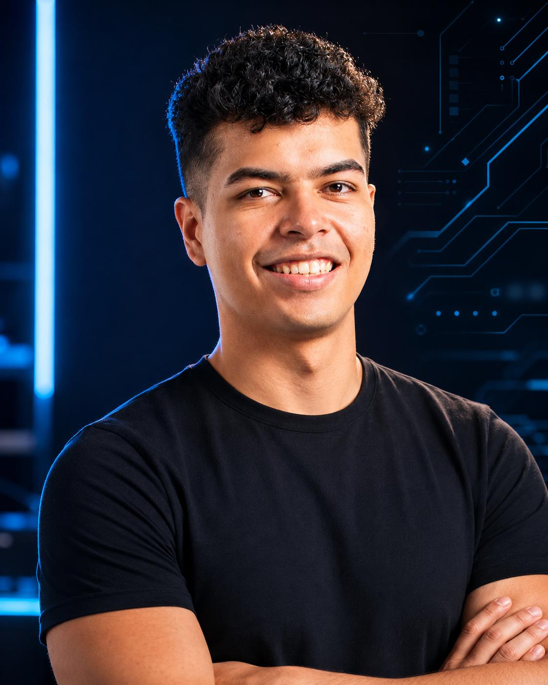

 

 

 &nbsp;·&nbsp; 

<h2 id="español"> Español</h2>

### Sobre mí

Desarrollador Full Stack y estudiante de Ingeniería de Software en Colombia. Lidero con pensamiento de diseño y construyo con precisión de ingeniería.

**Ganador del Hackathon TINKU 2026.** Entrego productos funcionales y pulidos bajo presión.

**Constructor de impacto social.** Construyo infraestructura digital para organizaciones sociales, grupos scouts y causas comunitarias en toda Colombia.

**Diseñador de nacimiento.** Ojo fuerte para UI/UX, tipografía, sistemas de color y jerarquía visual. Me importa tanto cómo se ve como cómo funciona.

**Líder de proyectos.** Comunico con claridad, alineo equipos alrededor de una visión compartida, y sé cuándo avanzar rápido y cuándo frenar a pensar.

**Obsesionado con el performance.** Optimizo imágenes, lazy loading, bundle size, Core Web Vitals y caché en CDN hasta que el Lighthouse queda en verde.

**Desarrollo asistido por IA.** Uso la IA como instrumento de precisión: diseño la arquitectura, tomo cada decisión de fondo y delego la ejecución repetitiva.

<h3 align="center"><samp>$ ls tech-stack/</samp></h3>

<samp>frontend/</samp>

  

<samp>backend/</samp>

  

<samp>design-and-cloud/</samp>

  

Donde más fuerte estoy: <b>Astro + TypeScript</b>, ahí vive la mayoría de mis repos.

Integro pasarelas de pago del mercado colombiano (<b>Bold, Wompi, ePayco, MercadoPago</b>) y cada sitio sale optimizado para <b>SEO</b> y búsqueda con IA (<b>GEO</b>).

### Ganador - TINKU Hackathon 2026

Competí en **[TINKU 2026](https://hackathon.thetribu.dev/)**, hackathon organizado por The Tribu y la Universidad Cooperativa de Colombia, con Cursor y Minimax como herramientas protagonistas.

**El proyecto: [Solara](https://github.com/The-Tribu/tinku_team_ojala_hubiera_pasado_a_la_utp)**

Plataforma de monitoreo solar unificado para [Techos Rentables](https://techosrentables.com). Consolida datos de **200+ proyectos solares** de múltiples marcas (Deye, Huawei, Growatt) en un solo dashboard, detecta fallas en **menos de 5 minutos** y elimina las **130+ horas/mes** de trabajo manual en generación de reportes.

[Ver repositorio](https://github.com/The-Tribu/tinku_team_ojala_hubiera_pasado_a_la_utp)

### Trabajo con ONGs y organizaciones sociales

Herramientas que usan organizaciones sociales en toda Colombia:

| Proyecto | Descripción | Enlace |
|---|---|---|
| **[JamCam 2025](https://github.com/MiloAgudelo/jamcam-astro)** | Sitio oficial del **Jamboree y Camporee Interamericano Scout**. Más de 4.000 asistentes y 36.000 visitas en su pico de tráfico. Optimizado para SEO y GEO | [jamcam2025.com](https://www.jamcam2025.com/) |
| **[scout.org.co](https://www.scout.org.co)** | Sitio web institucional de **Scouts de Colombia** | [scout.org.co](https://www.scout.org.co) |
| **Decídelo - Asambleas** | Plataforma de votaciones para asambleas en todos los niveles de la organización: grupo, región y nación | [decidelo.scout.org.co](https://decidelo.scout.org.co) |
| **[Visión Electoral](https://github.com/MiloAgudelo/vision-electoral)** | Proyecto académico de estudiantes de Ingeniería de Software. Análisis de datos de intención de voto para la segunda vuelta de las elecciones presidenciales de Colombia | [GitHub](https://github.com/MiloAgudelo/vision-electoral) |

Construyo la infraestructura que mantiene funcionando a estas organizaciones.

### Proyectos destacados

| [jamcam-astro](https://github.com/MiloAgudelo/jamcam-astro) | [vision-electoral](https://github.com/MiloAgudelo/vision-electoral) |
|:---:|:---:|
|  |  |
| Plataforma del Jamboree y Camporee Interamericano Scout | Análisis electoral para segunda vuelta presidencial |
|   |   |

### Estadísticas de GitHub

| | |
|:---:|:---:|
|  |  |

| | |
|:---:|:---:|
|  |  |

### Filosofía de diseño

> "El buen diseño es invisible. El gran diseño se siente."

Abordo cada proyecto con doble lente: diseñador e ingeniero en partes iguales. Eso significa:

- Jerarquía visual y sistemas de color que guían la mirada antes de leer una palabra
- Diseño de interacción que se siente intuitivo desde el primer uso
- Layouts responsivos que funcionan en cualquier dispositivo

Prototipo en Figma antes de construir y entrego interfaces que se ven tan bien como funcionan.

### Liderazgo y comunicación

Liderar proyectos técnicos requiere claridad técnica y claridad humana en igual medida:

- Traducir decisiones técnicas complejas a un lenguaje que todos los involucrados entiendan
- Alinear equipos multidisciplinarios alrededor de una visión común y mantener el impulso
- Saber cuándo avanzar rápido y cuándo frenar, pensar y rediseñar
- Dar retroalimentación directa que mejora el trabajo

He liderado proyectos de la ideación a producción, en hackathons y en el campo.

### Conectemos

&nbsp;

&nbsp;

&nbsp;

 

 Read in English

<h2>English</h2>

### About Me

Full Stack Developer and Software Engineering student from Colombia. I lead with design thinking and build with engineering precision.

**TINKU Hackathon 2026 Winner.** I deliver polished, working products under pressure.

**Social impact builder.** I build digital infrastructure for social organizations, scout groups, and community-driven causes across Colombia.

**Design-native.** Strong eye for UI/UX, typography, color systems, and visual hierarchy. I care as much about how it looks as how it works.

**Project leader.** I communicate clearly, align teams around a shared vision, and know when to move fast and when to slow down and think.

**Performance-obsessed.** I optimize images, lazy loading, bundle size, Core Web Vitals, and CDN caching until Lighthouse hits green.

**AI-assisted development.** I use AI as a precision instrument: I design the architecture, make every meaningful decision, and delegate the repetitive execution.

<h3 align="center"><samp>$ ls tech-stack/</samp></h3>

<samp>frontend/</samp>

  

<samp>backend/</samp>

  

<samp>design-and-cloud/</samp>

  

Strongest with <b>Astro + TypeScript</b>: most of my repos live there.

I integrate Colombian payment gateways (<b>Bold, Wompi, ePayco, MercadoPago</b>), and every site ships optimized for <b>SEO</b> and AI search (<b>GEO</b>).

### Winner - TINKU Hackathon 2026

Competed at **[TINKU 2026](https://hackathon.thetribu.dev/)**, organized by The Tribu and Universidad Cooperativa de Colombia, powered by Cursor and Minimax.

**The project: [Solara](https://github.com/The-Tribu/tinku_team_ojala_hubiera_pasado_a_la_utp)**

Unified solar monitoring platform for [Techos Rentables](https://techosrentables.com). Consolidates data from **200+ solar projects** across multiple brands (Deye, Huawei, Growatt) into a single dashboard, detects faults in **under 5 minutes**, and eliminates **130+ hours/month** of manual report generation.

[View repo](https://github.com/The-Tribu/tinku_team_ojala_hubiera_pasado_a_la_utp)

### NonProfit Work

Tools in production for social organizations across Colombia:

| Project | Description | Live |
|---|---|---|
| **[JamCam 2025](https://github.com/MiloAgudelo/jamcam-astro)** | Official site for the **Inter-American Scout Jamboree and Camporee**. 4,000+ attendees and 36,000+ visits at peak traffic. Optimized for SEO and GEO | [jamcam2025.com](https://www.jamcam2025.com/) |
| **[scout.org.co](https://www.scout.org.co)** | Institutional website of **Scouts de Colombia** | [scout.org.co](https://www.scout.org.co) |
| **Decídelo - Assemblies** | Voting platform for Scout assemblies at every level of the organization: group, region, and nation | [decidelo.scout.org.co](https://decidelo.scout.org.co) |
| **[Visión Electoral](https://github.com/MiloAgudelo/vision-electoral)** | Academic project by Software Engineering students. Voting intention data analysis for Colombia's presidential election runoff | [GitHub](https://github.com/MiloAgudelo/vision-electoral) |

I build the infrastructure that keeps these organizations running.

### Featured Projects

| [jamcam-astro](https://github.com/MiloAgudelo/jamcam-astro) | [vision-electoral](https://github.com/MiloAgudelo/vision-electoral) |
|:---:|:---:|
|  |  |
| Inter-American Scout Jamboree and Camporee platform | Electoral data analysis for Colombia's presidential runoff |
|   |   |

### GitHub Stats

| | |
|:---:|:---:|
|  |  |

| | |
|:---:|:---:|
|  |  |

### Design Philosophy

> "Good design is invisible. Great design is felt."

I approach every project as both designer and engineer in equal measure. That means:

- Visual hierarchy and color systems that guide the eye before a word is read
- Interaction design that feels intuitive from the first use
- Responsive layouts that work on every device

I prototype in Figma before I build, and I ship interfaces that look as good as they work.

### Leadership and Communication

Leading technical projects requires equal parts technical clarity and human clarity:

- Translating complex technical decisions into language every stakeholder understands
- Aligning cross-functional teams around a shared vision and keeping momentum
- Knowing when to move fast and when to slow down, think, and redesign
- Giving direct feedback that improves the work

I've led projects from ideation to production, in hackathons and in the field.

### Let's Connect

&nbsp;

&nbsp;

&nbsp;

 

Construyo cosas que importan. · I build things that matter.

